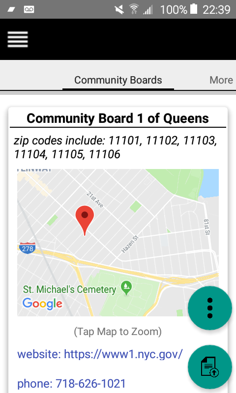
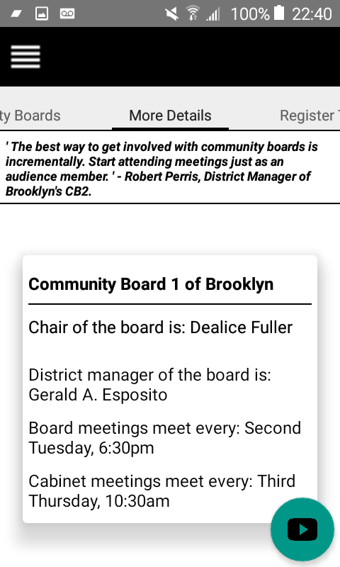
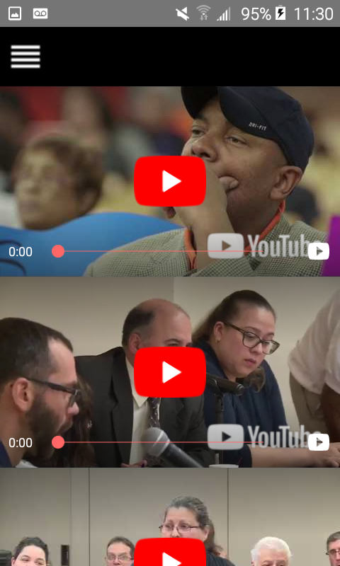
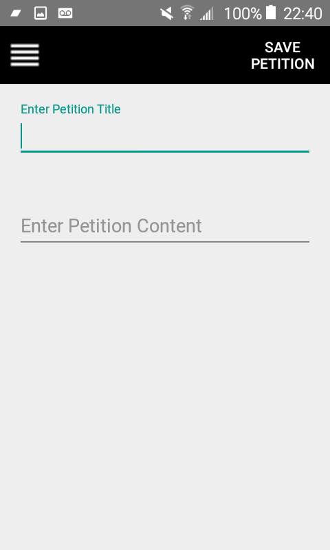
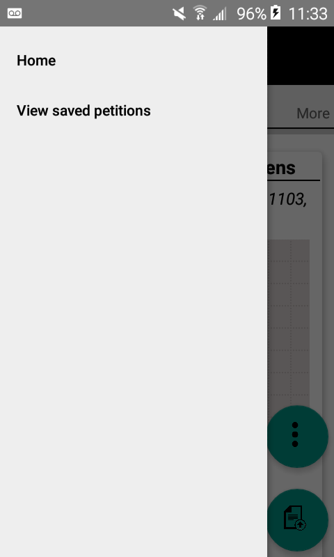

TOWNHALL!
===========

Stay engaged within your local communities and up to date with matters that affect home. 

----------------------------------------------------------------------------------------
Be sure to always implement voice and reason to counseling services that can make a difference. 
Whether you're speaking out for or against issues, NYC wants to hear it! 

----------------------------------------------------------------------
Townhall provides a mobile connection between convenience and communication to be as effective as you need to be in your community.

* Get directions to an actual Townhall meeting.
* Prepare a petition!
* Register to vote.
* Contact your board.
* Gather more information about your community board and members of elected seats.
* Become an advocate for your community and have your voice be heard today!
-----------------------------------------------------------------------------

,,,,

_____________________________________________________________________________________________________________________________________________________________________________________________________________________________________________________________________________________________________________________________________________________________________

LIBRARIES:
===========

* Retrofit
* Room Persistence
* Google Play Services
* Intents

CREDITS:
----------
* v1 - current dev : Vivian Kulumba
* v1 Design Lead - UI/UX : Niema Widaha
