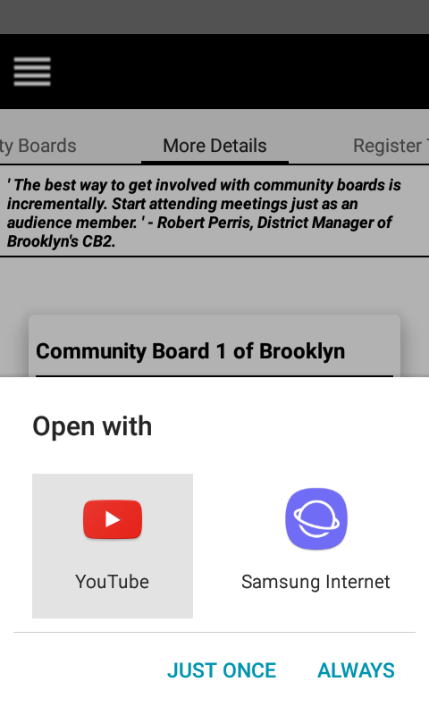
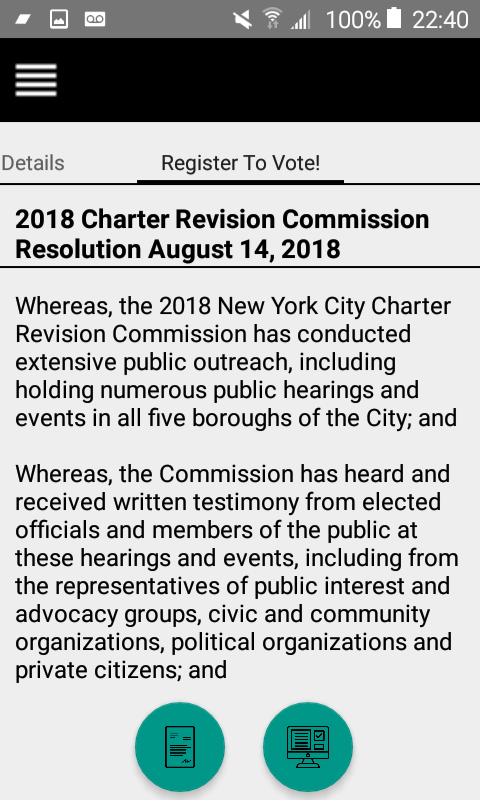
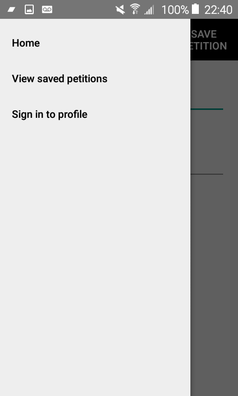

TOWNHALL!
===========

Stay engaged within your local communities and up to date with matters that affect home. 

----------------------------------------------------------------------------------------
Be sure to always implement voice and reason to counseling services that can make a difference. 
Whether you're speaking out for or against issues, NYC wants to hear it! 

----------------------------------------------------------------------
Townhall provides a mobile connection between convenience and communication to be as effective as you need to be in your community.

* Visit an actual Townhall meeting.
* Submit a petition!
* Volunteer at an event or two.
* Explore facilities that are here for you and your community.
* Become an advocate for your community and have your voice be heard today!
-----------------------------------------------------------------------------

,,,,,

_____________________________________________________________________________________________________________________________________________________________________________________________________________________________________________________________________________________________________________________________________________________________________

LIBRARIES:
===========

* Retrofit
* Room Persistence
* Google Play Services

CREDITS:
----------
* Tech Lead - UI/UX : Vivian Kulumba
* Design Lead - UI/UX : Niema Widaha
